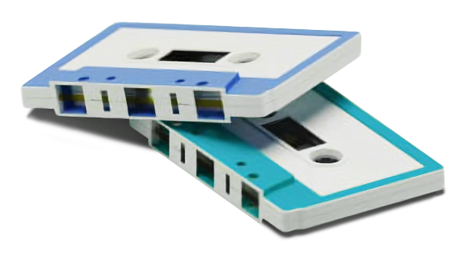

# "Safe and Sound" WAV Steganography Webapp

Web app for embedding secret text messages into **.wav** sound files. The app has been made using **__PHP__** (for user interface, server responses and preprocessing the data) and **__Python__** (for the actual steganographic process).

The project was made for the "Modular Arithmetics and Cryptography" course (1st year of Master - Distributed Systems in Internet).

    

## Prerequisites

1. Add **.py** in the file **[ _ApacheDir_ ]/conf/httpd.conf** at the end of the line so the _PHP_ app can run the _Python_ script.

    > AddHandler cgi-script .cgi .pl .asp **.py**

    

1. Set the maximum allowed file size for upload:
    - In file **[ __PHP Dir__ ]/php.ini** change the lines:
        > **post_max_size=25M**

        > **upload_max_filesize=25M**    

    - Change _constant_ value **___WAV_FILE_INT_MAX_SIZE_ALLOWED__** to **__25M__** in file **core/utils/class.Constants.php**
 
## Acknowledgments

The **__Python__** script was inspired by _Pavan Chhatpar_'s [_wav-steg-py_](https://github.com/pavanchhatpar/wav-steg-py) project.